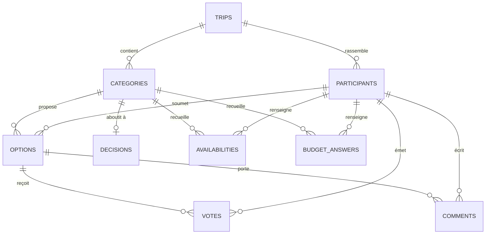

# 03 — Modèle de données (Supabase / Postgres)

## 3.1 Principes

1. **Le lien est la clé d'accès.** Le `slug` d'un sondage est un secret à haute entropie. Le connaître donne le droit de rejoindre — c'est un modèle « capability ». On ne peut donc pas rendre la table `trips` lisible librement : la lecture passe par une fonction `SECURITY DEFINER` qui exige le slug.
2. **Auth anonyme Supabase.** Au premier `Rejoindre`, le client appelle `signInAnonymously()`. Le JWT obtenu identifie l'appareil (`auth.uid()`), est persisté en `localStorage` et sert d'ancrage à toute la RLS. L'utilisateur ne voit jamais cette mécanique.
3. **Toute la sécurité est en base.** Aucune règle d'accès ne repose sur le front. Le mode aveugle lui-même est appliqué par une policy RLS, pas par un `if` dans un composant.
4. **Dénormalisation assumée de `trip_id`** sur les tables filles : les policies RLS s'évaluent sur chaque ligne, une jointure remontant jusqu'au sondage à chaque vérification serait coûteuse.
5. **Écritures par RPC.** Les mutations non triviales (rejoindre, voter, clôturer) passent par des fonctions Postgres, pour garantir l'atomicité et centraliser les règles métier.

## 3.2 Diagramme



## 3.3 Types

```sql
create extension if not exists pgcrypto;

create type trip_status         as enum ('draft', 'open', 'closed', 'archived');
create type category_kind       as enum ('destination', 'dates', 'budget', 'lodging', 'activity', 'custom');
create type vote_mode           as enum ('approval', 'single', 'multiple', 'availability', 'amount');
create type category_status     as enum ('open', 'closed');
create type availability_status as enum ('yes', 'maybe', 'no');
```

## 3.4 Tables

```sql
-- ─────────────────────────────────────────────── trips
create table trips (
  id                 uuid primary key default gen_random_uuid(),
  slug               text unique not null check (slug ~ '^[A-Za-z0-9_-]{12,32}$'),
  title              text not null check (char_length(title) between 1 and 120),
  description        text check (char_length(description) <= 2000),
  cover_emoji        text default '🏖️',
  status             trip_status not null default 'open',
  blind_mode         boolean not null default false,
  created_at         timestamptz not null default now(),
  updated_at         timestamptz not null default now(),
  last_activity_at   timestamptz not null default now()
);

-- ─────────────────────────────────────────────── participants
create table participants (
  id            uuid primary key default gen_random_uuid(),
  trip_id       uuid not null references trips(id) on delete cascade,
  display_name  text not null check (char_length(display_name) between 1 and 40),
  avatar_emoji  text,
  avatar_color  text,
  auth_uid      uuid references auth.users(id) on delete set null,
  is_organizer  boolean not null default false,
  created_at    timestamptz not null default now(),
  last_seen_at  timestamptz not null default now()
);
create unique index participants_trip_auth_key on participants (trip_id, auth_uid) where auth_uid is not null;
create unique index participants_trip_name_key on participants (trip_id, lower(display_name));
-- Un seul organisateur par sondage
create unique index participants_one_organizer on participants (trip_id) where is_organizer;

-- ─────────────────────────────────────────────── categories
create table categories (
  id                        uuid primary key default gen_random_uuid(),
  trip_id                   uuid not null references trips(id) on delete cascade,
  kind                      category_kind not null,
  label                     text not null check (char_length(label) between 1 and 60),
  description               text check (char_length(description) <= 1000),
  vote_mode                 vote_mode not null,
  status                    category_status not null default 'open',
  position                  smallint not null default 0,
  allow_participant_options boolean not null default true,
  max_choices               smallint check (max_choices is null or max_choices > 0),
  -- spécifique au mode 'availability'
  window_start              date,
  window_end                date,
  nights                    smallint check (nights is null or nights between 1 and 60),
  -- spécifique au mode 'amount'
  currency                  char(3) not null default 'EUR',
  created_at                timestamptz not null default now(),

  constraint dates_window_required check (
    vote_mode <> 'availability'
    or (window_start is not null and window_end is not null and nights is not null
        and window_end > window_start
        and window_end - window_start <= 400)
  )
);
create index categories_trip_idx on categories (trip_id, position);

-- ─────────────────────────────────────────────── options
create table options (
  id           uuid primary key default gen_random_uuid(),
  trip_id      uuid not null references trips(id) on delete cascade,
  category_id  uuid not null references categories(id) on delete cascade,
  title        text not null check (char_length(title) between 1 and 120),
  description  text check (char_length(description) <= 1000),
  url          text check (url is null or url ~ '^https?://'),
  image_url    text,
  meta         jsonb not null default '{}'::jsonb,
  created_by   uuid references participants(id) on delete set null,
  position     smallint not null default 0,
  created_at   timestamptz not null default now()
);
create index options_category_idx on options (category_id, position, created_at);

-- ─────────────────────────────────────────────── votes
-- value : approval → -1 (non) / 0 (peut-être) / 1 (oui) ; single & multiple → 1
create table votes (
  id             uuid primary key default gen_random_uuid(),
  trip_id        uuid not null references trips(id) on delete cascade,
  category_id    uuid not null references categories(id) on delete cascade,
  option_id      uuid not null references options(id) on delete cascade,
  participant_id uuid not null references participants(id) on delete cascade,
  value          smallint not null check (value between -1 and 1),
  created_at     timestamptz not null default now(),
  updated_at     timestamptz not null default now(),
  unique (participant_id, option_id)
);
create index votes_option_idx   on votes (option_id);
create index votes_category_idx on votes (category_id, participant_id);

-- ─────────────────────────────────────────────── availabilities (catégorie dates)
create table availabilities (
  id             uuid primary key default gen_random_uuid(),
  trip_id        uuid not null references trips(id) on delete cascade,
  category_id    uuid not null references categories(id) on delete cascade,
  participant_id uuid not null references participants(id) on delete cascade,
  day            date not null,
  status         availability_status not null,
  updated_at     timestamptz not null default now(),
  unique (participant_id, category_id, day)
);
create index availabilities_category_idx on availabilities (category_id, day);

-- ─────────────────────────────────────────────── budget_answers (catégorie budget)
-- CONFIDENTIEL : jamais exposé ligne à ligne, y compris à l'organisateur.
create table budget_answers (
  id             uuid primary key default gen_random_uuid(),
  trip_id        uuid not null references trips(id) on delete cascade,
  category_id    uuid not null references categories(id) on delete cascade,
  participant_id uuid not null references participants(id) on delete cascade,
  amount         integer not null check (amount >= 0 and amount <= 1000000),
  created_at     timestamptz not null default now(),
  updated_at     timestamptz not null default now(),
  unique (participant_id, category_id)
);

-- ─────────────────────────────────────────────── comments
create table comments (
  id             uuid primary key default gen_random_uuid(),
  trip_id        uuid not null references trips(id) on delete cascade,
  category_id    uuid references categories(id) on delete cascade,
  option_id      uuid references options(id) on delete cascade,
  participant_id uuid references participants(id) on delete set null,
  body           text not null check (char_length(body) between 1 and 1000),
  created_at     timestamptz not null default now()
);
create index comments_option_idx on comments (option_id, created_at);

-- ─────────────────────────────────────────────── decisions
create table decisions (
  id           uuid primary key default gen_random_uuid(),
  trip_id      uuid not null references trips(id) on delete cascade,
  category_id  uuid not null unique references categories(id) on delete cascade,
  option_id    uuid references options(id) on delete set null,
  free_text    text check (char_length(free_text) <= 200),
  payload      jsonb not null default '{}'::jsonb,  -- ex. dates : {"start":"2027-07-11","end":"2027-07-18"}
  decided_by   uuid references participants(id) on delete set null,
  decided_at   timestamptz not null default now(),
  constraint decision_not_empty check (option_id is not null or free_text is not null or payload <> '{}'::jsonb)
);
```

## 3.5 Fonctions d'accès (socle RLS)

```sql
-- Participant courant dans un sondage donné, d'après le JWT anonyme.
create or replace function app_current_participant(p_trip uuid)
returns uuid language sql stable security definer set search_path = public as $$
  select id from participants
  where trip_id = p_trip and auth_uid = auth.uid()
  limit 1;
$$;

create or replace function app_is_participant(p_trip uuid)
returns boolean language sql stable security definer set search_path = public as $$
  select exists (
    select 1 from participants
    where trip_id = p_trip and auth_uid = auth.uid()
  );
$$;

create or replace function app_is_organizer(p_trip uuid)
returns boolean language sql stable security definer set search_path = public as $$
  select exists (
    select 1 from participants
    where trip_id = p_trip and auth_uid = auth.uid() and is_organizer
  );
$$;

-- Mode aveugle : peut-on voir les votes des autres dans cette catégorie ?
create or replace function app_can_see_votes(p_category uuid)
returns boolean language sql stable security definer set search_path = public as $$
  select case
    when c.status = 'closed' then true
    when not t.blind_mode    then true
    else exists (
      select 1 from votes v
      join participants p on p.id = v.participant_id
      where v.category_id = c.id and p.auth_uid = auth.uid()
    ) or exists (
      select 1 from availabilities a
      join participants p on p.id = a.participant_id
      where a.category_id = c.id and p.auth_uid = auth.uid()
    )
  end
  from categories c join trips t on t.id = c.trip_id
  where c.id = p_category;
$$;
```

## 3.6 Policies RLS

```sql
alter table trips           enable row level security;
alter table participants    enable row level security;
alter table categories      enable row level security;
alter table options         enable row level security;
alter table votes           enable row level security;
alter table availabilities  enable row level security;
alter table budget_answers  enable row level security;
alter table comments        enable row level security;
alter table decisions       enable row level security;

-- trips : lisible uniquement par ses participants ; création & modification par RPC / organisateur
create policy trips_select on trips for select
  using (app_is_participant(id));
create policy trips_update on trips for update
  using (app_is_organizer(id)) with check (app_is_organizer(id));
create policy trips_delete on trips for delete
  using (app_is_organizer(id));

-- participants : visibles entre eux ; chacun modifie sa propre ligne ; l'organisateur peut retirer
create policy participants_select on participants for select
  using (app_is_participant(trip_id));
create policy participants_update_self on participants for update
  using (auth_uid = auth.uid()) with check (auth_uid = auth.uid());
create policy participants_delete on participants for delete
  using (app_is_organizer(trip_id) or auth_uid = auth.uid());

-- categories : lecture par les participants, écriture par l'organisateur
create policy categories_select on categories for select
  using (app_is_participant(trip_id));
create policy categories_write on categories for all
  using (app_is_organizer(trip_id)) with check (app_is_organizer(trip_id));

-- options : lecture par les participants ; ajout si la catégorie l'autorise et est ouverte
create policy options_select on options for select
  using (app_is_participant(trip_id));
create policy options_insert on options for insert with check (
  app_is_participant(trip_id)
  and created_by = app_current_participant(trip_id)
  and exists (
    select 1 from categories c
    where c.id = category_id and c.status = 'open'
      and (c.allow_participant_options or app_is_organizer(trip_id))
  )
);
create policy options_update on options for update
  using (app_is_organizer(trip_id) or created_by = app_current_participant(trip_id));
create policy options_delete on options for delete using (
  app_is_organizer(trip_id)
  or (created_by = app_current_participant(trip_id)
      and not exists (
        select 1 from votes v
        where v.option_id = options.id
          and v.participant_id <> options.created_by))
);

-- votes : mes votes toujours visibles ; ceux des autres selon le mode aveugle
create policy votes_select on votes for select using (
  app_is_participant(trip_id)
  and (participant_id = app_current_participant(trip_id) or app_can_see_votes(category_id))
);
create policy votes_write on votes for all
  using (
    participant_id = app_current_participant(trip_id)
    and exists (select 1 from categories c where c.id = category_id and c.status = 'open')
  )
  with check (
    participant_id = app_current_participant(trip_id)
    and exists (select 1 from categories c where c.id = category_id and c.status = 'open')
  );

-- availabilities : mêmes règles que les votes
create policy availabilities_select on availabilities for select using (
  app_is_participant(trip_id)
  and (participant_id = app_current_participant(trip_id) or app_can_see_votes(category_id))
);
create policy availabilities_write on availabilities for all
  using (participant_id = app_current_participant(trip_id))
  with check (participant_id = app_current_participant(trip_id));

-- budget_answers : STRICTEMENT personnel. Aucune lecture d'autrui, même organisateur.
-- Les agrégats passent exclusivement par la RPC app_budget_summary().
create policy budget_select_self on budget_answers for select
  using (participant_id = app_current_participant(trip_id));
create policy budget_write_self on budget_answers for all
  using (participant_id = app_current_participant(trip_id))
  with check (participant_id = app_current_participant(trip_id));

-- comments : lecture par les participants, écriture par soi
create policy comments_select on comments for select
  using (app_is_participant(trip_id));
create policy comments_insert on comments for insert
  with check (participant_id = app_current_participant(trip_id));
create policy comments_delete on comments for delete
  using (participant_id = app_current_participant(trip_id) or app_is_organizer(trip_id));

-- decisions : lecture par les participants, écriture via RPC de clôture
create policy decisions_select on decisions for select
  using (app_is_participant(trip_id));
```

> **Note** : aucune policy `insert` sur `trips` ni `participants`. La création et l'adhésion passent obligatoirement par les RPC ci-dessous, seul endroit où le slug est vérifié.

## 3.7 RPC (API métier)

| Fonction | Rôle | Sécurité |
|---|---|---|
| `app_create_trip(title, emoji, display_name, categories jsonb)` | Crée le sondage, ses catégories et l'organisateur en une transaction. Génère le slug. | `SECURITY DEFINER`, exige un JWT (anonyme accepté) |
| `app_trip_preview(slug)` | Renvoie titre, emoji, description, libellés de catégories et nombre de participants, **sans** les propositions ni les votes. Alimente l'écran d'accueil avant identification. | `SECURITY DEFINER`, limité en débit |
| `app_join_trip(slug, display_name)` | Rattache `auth.uid()` au sondage. Idempotent : renvoie le participant existant le cas échéant. Déduplique le pseudo. | `SECURITY DEFINER` |
| `app_claim_participant(slug, participant_id)` | « C'est déjà moi » : réattribue une fiche participant orpheline au JWT courant. | `SECURITY DEFINER`, refuse si la fiche a déjà un `auth_uid` actif |
| `app_cast_vote(option_id, value)` | Upsert d'un vote. En mode `single`, supprime les autres votes du participant dans la catégorie. Refuse si catégorie clôturée. | `SECURITY DEFINER` |
| `app_set_availability(category_id, days jsonb)` | Upsert en masse des disponibilités (`[{"day":"2027-07-11","status":"yes"}, …]`). | `SECURITY DEFINER` |
| `app_set_budget(category_id, amount)` | Upsert du montant personnel. | `SECURITY DEFINER` |
| `app_category_results(category_id)` | Scores agrégés par proposition (oui / peut-être / non / score / votants). Renvoie une erreur `blind_mode_active` si le participant n'a pas encore voté. | `SECURITY DEFINER` |
| `app_budget_summary(category_id)` | `{respondents, min, median, max, histogram}`. Renvoie `insufficient_respondents` en dessous de 3 réponses. **Ne renvoie jamais de montant nominatif.** | `SECURITY DEFINER` |
| `app_date_windows(category_id)` | Top N des fenêtres de `nights` nuits classées par score, avec la liste des indisponibles. | `SECURITY DEFINER` |
| `app_close_category(category_id, option_id, free_text, payload)` | Clôture + écriture de la décision. Passe le sondage en `closed` si c'était la dernière catégorie ouverte. | organisateur uniquement |
| `app_reopen_category(category_id)` | Rouvre et supprime la décision. | organisateur uniquement |

**Squelette de référence — `app_join_trip`**

```sql
create or replace function app_join_trip(p_slug text, p_display_name text)
returns json language plpgsql security definer set search_path = public as $$
declare
  v_trip trips%rowtype;
  v_participant participants%rowtype;
  v_name text := trim(p_display_name);
  v_suffix int := 1;
begin
  if auth.uid() is null then
    raise exception 'auth_required' using errcode = '28000';
  end if;

  select * into v_trip from trips where slug = p_slug;
  if not found then
    raise exception 'trip_not_found' using errcode = 'P0002';
  end if;
  if v_trip.status = 'archived' then
    raise exception 'trip_archived';
  end if;

  -- déjà participant sur cet appareil : idempotent
  select * into v_participant from participants
   where trip_id = v_trip.id and auth_uid = auth.uid();
  if found then
    update participants set last_seen_at = now() where id = v_participant.id;
    return json_build_object('trip_id', v_trip.id, 'participant_id', v_participant.id);
  end if;

  if (select count(*) from participants where trip_id = v_trip.id) >= 50 then
    raise exception 'participant_limit_reached';
  end if;

  -- déduplication du pseudo
  while exists (select 1 from participants
                where trip_id = v_trip.id and lower(display_name) = lower(v_name)) loop
    v_suffix := v_suffix + 1;
    v_name := trim(p_display_name) || ' (' || v_suffix || ')';
  end loop;

  insert into participants (trip_id, display_name, auth_uid)
  values (v_trip.id, v_name, auth.uid())
  returning * into v_participant;

  update trips set last_activity_at = now() where id = v_trip.id;

  return json_build_object(
    'trip_id', v_trip.id,
    'participant_id', v_participant.id,
    'display_name', v_name
  );
end;
$$;
revoke all on function app_join_trip(text, text) from public;
grant execute on function app_join_trip(text, text) to authenticated;
```

## 3.8 Vues de lecture

```sql
-- Scores par proposition, soumis à la RLS de l'appelant (security_invoker).
create view option_scores with (security_invoker = on) as
select
  o.id as option_id,
  o.category_id,
  o.trip_id,
  count(*) filter (where v.value = 1)  as yes_count,
  count(*) filter (where v.value = 0)  as maybe_count,
  count(*) filter (where v.value = -1) as no_count,
  coalesce(sum(case v.value when 1 then 2 when 0 then 1 else 0 end), 0) as score
from options o
left join votes v on v.option_id = o.id
group by o.id;
```

> ⚠️ En mode aveugle, la RLS masque les votes d'autrui : cette vue renverra donc naturellement les seuls votes du participant courant tant qu'il n'a pas voté. C'est le comportement voulu — l'UI n'affiche pas de scores dans cet état.

## 3.9 Déclencheurs

| Déclencheur | Table | Effet |
|---|---|---|
| `touch_last_activity` | `votes`, `options`, `comments`, `availabilities`, `budget_answers` | met à jour `trips.last_activity_at` |
| `set_updated_at` | `trips`, `votes`, `budget_answers`, `availabilities` | met à jour `updated_at` |
| `enforce_single_choice` | `votes` (before insert/update) | en mode `single`, supprime les autres votes du participant dans la catégorie |
| `enforce_max_choices` | `votes` (before insert) | en mode `multiple`, refuse au-delà de `categories.max_choices` |
| `guard_closed_category` | `votes`, `availabilities`, `budget_answers`, `options` | refuse toute écriture si la catégorie est `closed` |
| `cap_options` | `options` | refuse au-delà de 100 propositions par catégorie |

## 3.10 Realtime

Publication `supabase_realtime` sur : `votes`, `options`, `comments`, `participants`, `decisions`, `availabilities`.

- Abonnement côté client filtré par `trip_id=eq.<uuid>`.
- Le Realtime autorisé par RLS est activé : un participant en mode aveugle **ne reçoit pas** les événements de vote qu'il n'a pas le droit de lire.
- `budget_answers` est **exclue** de la publication (confidentialité).
- Chaque événement reçu invalide la clé TanStack Query correspondante plutôt que de patcher le cache à la main (voir doc 04).

## 3.11 Cycle de vie & purge

```sql
-- pg_cron, tous les jours à 4h
select cron.schedule('archive-stale-trips', '0 4 * * *', $$
  update trips set status = 'archived'
   where status in ('open','closed') and last_activity_at < now() - interval '180 days';
  delete from trips
   where status = 'archived' and last_activity_at < now() - interval '365 days';
$$);
```

Les suppressions en cascade nettoient l'ensemble des données rattachées. Les utilisateurs anonymes `auth.users` orphelins sont purgés par un job distinct.

## 3.12 Migrations

Les migrations vivent dans `supabase/migrations/`, une par lot fonctionnel, jamais modifiée après application :

```
supabase/migrations/
  20260101000000_init_types_and_tables.sql
  20260101000100_rls_helpers_and_policies.sql
  20260101000200_rpc_trip_lifecycle.sql
  20260101000300_rpc_voting.sql
  20260101000400_views_triggers.sql
  20260101000500_realtime_and_cron.sql
```

Les types TypeScript sont générés depuis le schéma : `supabase gen types typescript --linked > src/types/database.ts`, régénérés à chaque migration et versionnés.
