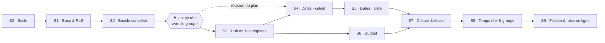

# 08 — Sprints de développement

> **Mode retenu** : je développe en autonomie, tu valides à la fin de chaque sprint.
> **Cadence retenue** : un sprint = **un bloc de travail**, pas un créneau calendaire. Aucune date, aucune échéance — la même règle que celle qu'on applique au produit (ADR-009).

## 8.1 Ce qu'est un sprint ici

Un sprint est un bloc de travail que j'ouvre et que je ferme, dimensionné pour qu'à la fin **tu puisses vérifier le résultat en 5 minutes sans lire le code**.

Chaque sprint se termine par trois choses :
1. une **branche + une PR** que tu relis et que tu merges (je ne merge jamais) ;
2. un **script de recette** numéroté que tu joues toi-même ;
3. une section **« décidé sans toi »** dans la PR, listant les arbitrages que j'ai pris et comment les annuler.

Les tailles sont relatives, pas horaires : **S** = un petit bloc, **M** = un bloc standard, **L** = un gros bloc, potentiellement à couper en deux si la recette devient illisible.

## 8.2 Ce que je ne fais pas sans toi

Je m'arrête et je te demande dès qu'une des situations suivantes se présente :

- une décision **irréversible** : suppression de données, choix de domaine, changement d'un ADR du doc 07 ;
- un **test de sécurité qui échoue** (doc 04 §4.7) — je ne contourne jamais, je remonte ;
- une **question ouverte du doc 07** qui bloque réellement le sprint (Q2 le domaine, Q3 l'ampleur des dates) ;
- un besoin de **dépendance nouvelle** non prévue au doc 04 §4.2.

Partout ailleurs, je prends l'option **la plus réversible** et je la note dans la PR. Tu n'as jamais à deviner ce que j'ai décidé seul : c'est écrit noir sur blanc en bas de chaque PR.

## 8.3 Ce que toi seul peux faire

Ces actions me bloquent. Aucune ne prend plus de dix minutes, mais tant qu'elles ne sont pas faites, le sprint concerné ne peut pas démarrer.

| Quand | Action | Ce que ça débloque |
|---|---|---|
| **Avant le sprint 0** | `git init`, créer le dépôt GitHub, m'autoriser à y pousser. **Le dossier n'est aujourd'hui pas versionné** — sans git, pas de branche, pas de PR, pas de retour en arrière possible. | tout le mode autonome |
| **Avant le sprint 1** | Créer le projet Supabase `holidays-dev`, activer **Anonymous sign-ins**, me transmettre l'URL et la clé `anon` (publique par nature, elle va dans `.env.local`, ignoré par git). | sprints 1 → 9 |
| **Après le sprint 2** | ⚑ **Utiliser l'app pour de vrai avec le groupe.** C'est le jalon le plus important du projet. | sprints 3 → 9 |
| **Avant le sprint 9** | Créer le projet `holidays-prod`, un compte Netlify ou Vercel, et trancher Q1 (nom) et Q2 (domaine). | mise en ligne |

## 8.4 Enchaînement

Les sprints 4/5 (dates) et 6 (budget) sont **indépendants** : si le jalon montre que le groupe ne veut voter que sur la destination et les dates, le sprint 6 saute sans rien casser.

---

## Sprint 0 — Socle

**Objectif** : passer du template Vite à un projet sous contrôle, stylé et livrable en continu.
**Taille** : M · **Prérequis** : dépôt git créé.

| Tâche | Réf. |
|---|---|
| `git init`, premier commit du template, `.gitignore` complété (`.env.local`, `.idea/`) | — |
| Nettoyage du template : compteur, assets de démo, `App.css` | 0.1 |
| Tailwind 4 + shadcn/ui : thème, variables de couleur (`--brand`, `--yes`, `--maybe`, `--no`), mode sombre | 0.2 |
| React Router + squelette des 8 routes + `ErrorBoundary` par route | 0.5 |
| `QueryClientProvider`, `providers.tsx`, `Toaster` | 0.5 |
| Structure `features/`, `lib/labels.ts`, `lib/queryKeys.ts`, `components/common/` (Empty, Error, Loading) | 0.7 |
| CI GitHub Actions : `oxlint → tsc --noEmit → vitest → build` | 0.6 |

**Livrable** : l'app démarre, l'accueil est stylé aux couleurs du produit, les routes répondent, la CI est verte.

**Recette**
1. `npm install && npm run dev`, ouvrir `localhost:5173`.
2. L'accueil affiche le titre, le sous-titre et le bouton **Créer un sondage** (inactif à ce stade).
3. Basculer le thème système en sombre : les couleurs suivent.
4. Ouvrir `/t/nimportequoi` → page 404 soignée, pas d'écran blanc.
5. Sur GitHub, la CI du premier push est verte.

**Fini quand** : CI verte, aucun reste du template Vite, aucune chaîne visible hors de `lib/labels.ts`.

---

## Sprint 1 — Base de données & sécurité

**Objectif** : le schéma et la RLS du doc 03 en place et **prouvés** avant qu'une seule ligne d'interface ne s'y appuie.
**Taille** : L · **Prérequis** : projet `holidays-dev`, auth anonyme activée, clés transmises.

| Tâche | Réf. |
|---|---|
| Migration 1 : types + `trips`, `participants`, `categories`, `options`, `votes` + index | 1.1 |
| Migration 2 : `app_current_participant`, `app_is_participant`, `app_is_organizer`, `app_can_see_votes` + policies | 1.2 |
| Migration 3 : RPC `app_create_trip`, `app_trip_preview`, `app_join_trip` | 1.3 |
| Migration 4 : RPC `app_cast_vote` + déclencheurs (choix unique, catégorie clôturée, plafonds) | 1.4 |
| `supabase gen types` → `src/types/database.ts` + `types/domain.ts` | 1.5 |
| `lib/supabase.ts`, `lib/auth.ts` (session anonyme paresseuse et persistée) | 0.3 / 0.4 |
| `seed.sql` : un sondage de démo, 4 participants, votes croisés | — |
| **Les 4 tests de sécurité** du doc 04 §4.7, exécutés en CI | 1.11 |

**Livrable** : une base peuplée, et une suite de tests qui démontre qu'on ne peut pas en sortir.

**Recette**
1. Dans le dashboard Supabase, `Table editor` : les 5 tables existent, le sondage de démo est là.
2. `npm run test:security` → 4 tests verts, sortie lisible en français.
3. Dans `SQL editor`, exécuter la requête de contre-épreuve fournie dans la PR (lecture d'un sondage sans y participer) → **0 ligne**.
4. La CI est verte sur la branche.

**Fini quand** : les 4 tests de sécurité passent, les types sont générés et commités, aucune policy `insert` directe sur `trips` ou `participants`.

**Je te remonterai** : la politique exacte de génération du slug (longueur, alphabet) — choix par défaut 16 caractères base58, ≈ 93 bits.

---

## Sprint 2 — La boucle complète ⚑

**Objectif** : **le sprint qui rend le projet réel.** Créer un sondage, l'envoyer, le rejoindre, voter sur une destination — de bout en bout, sur téléphone.
**Taille** : L · **Prérequis** : sprint 1 mergé.

Une seule catégorie (Destination), un seul mode de vote (approbation). Pas de hub, pas de réglages, pas de clôture.

| Tâche | Réf. |
|---|---|
| Écran É2 — création : titre, emoji, catégorie Destination, prénom | 1.6 |
| Modale de partage : copie, `navigator.share`, message pré-rempli | 1.7 |
| Écran É3 — `JoinGate` : aperçu via `app_trip_preview`, adhésion par prénom, déduplication | 1.8 |
| Écran É5a — `OptionCard`, `ApprovalButtons`, mutation optimiste, reprise sur échec | 1.9 |
| Ajout de proposition inline | 1.10 |
| E2E Playwright : Marie crée → Thomas rejoint et vote → Marie voit le résultat | 1.12 |
| Déploiement de prévisualisation par PR | — |

**Livrable** : une URL de prévisualisation que tu peux réellement envoyer dans le groupe.

**Recette** — à jouer **sur ton téléphone**, pas sur le poste de dev
1. Créer un sondage « Vacances test », proposer 3 destinations.
2. Copier le lien, l'envoyer sur le groupe (ou dans une fenêtre de navigation privée).
3. Depuis le second navigateur : le titre et les 3 destinations sont visibles **avant** d'entrer un prénom.
4. Entrer un prénom, voter Oui / Peut-être / Non — chaque tap est enregistré sans bouton Valider.
5. Recharger la page : le prénom et les votes sont retrouvés.
6. Revenir au premier navigateur, rafraîchir : les votes du second sont comptés.
7. Passer en mode avion, voter → message d'échec avec bouton Réessayer, pas d'écran blanc.

**Fini quand** : la recette passe sur Safari iOS réel, l'E2E est verte, et aucun `any` n'a été introduit.

> ### ⚑ Jalon — on s'arrête ici
> Avant le sprint 3, **utilise l'app avec ton groupe pour une vraie décision**. Trois questions à te poser à la sortie (doc 07 §7.4) :
> - Les potes fantômes ont-ils voté ? (taux de participation à 72 h)
> - Le multi-catégories est-il attendu, ou la destination suffit-elle ?
> - Qu'est-ce qui a coincé que personne n'avait prévu ?
>
> Le plan qui suit est une **hypothèse**. Si le terrain dit autre chose, on réécrit les sprints 3 à 9 plutôt que de les dérouler.

---

## Sprint 3 — Hub multi-catégories

**Objectif** : un sondage couvre plusieurs axes de décision, et le participant sait où il en est.
**Taille** : M · **Prérequis** : jalon franchi.

| Tâche | Réf. |
|---|---|
| Sélecteur de catégories à la création (Destination, Logement, Activités, Autre) | 2.1 |
| Écran É4 — hub : cartes de catégorie, pastilles d'état, participation, progression | 2.2 |
| Navigation inter-catégories : barre basse, action « Continuer à voter » | 2.3 |
| Modes de vote `single` et `multiple` (+ `max_choices`) | 2.4 |
| Réglages de catégorie côté organisateur : libellé, ordre, propositions autorisées | 2.5 |
| Écran `/mine` — sondages visités depuis cet appareil | 2.6 |

**Recette**
1. Créer un sondage avec Destination + Logement + Activités.
2. Depuis un second navigateur, rejoindre : le hub montre 3 catégories, toutes `À voter`.
3. Cliquer **Continuer à voter** → première catégorie ; voter ; la barre basse propose la suivante.
4. Après la dernière : bandeau « Tu es à jour », et le hub affiche 3/3.
5. Sur Activités (choix multiple plafonné à 2), sélectionner un 3ᵉ élément → refus explicite.
6. Ouvrir `/mine` : les deux sondages visités sont listés.

---

## Sprint 4 — Dates, le calcul

**Objectif** : l'algorithme de créneaux, isolé et prouvé, **avant** de dessiner quoi que ce soit.
**Taille** : S · **Prérequis** : sprint 3 mergé, Q3 tranchée.

| Tâche | Réf. |
|---|---|
| Migration `availabilities` + policies + RPC `app_set_availability` | 3.1 |
| Configuration de la catégorie dates (fenêtre, nombre de nuits) à la création | 3.2 |
| `lib/scoring.ts` — fenêtres glissantes et scores, **couverture 100 %** | 3.5 |

**Recette**
1. `npm run test -- scoring` → 100 % de couverture sur `scoring.ts`.
2. Lire le tableau de cas de test dans la PR : groupe de 3 aux dispos croisées, le créneau attendu sort bien en tête, et le cas « personne n'est dispo en même temps » ne plante pas.

> **Point de décision (Q3)** : ce sprint et le suivant pèsent à eux deux près d'un cinquième de la v1. Une version dégradée — l'organisateur propose 3 créneaux, on vote en approbation — coûterait un sprint S au lieu de S+L. Si le jalon n'a pas montré que la grille de dispos est indispensable, **prends la version dégradée** : elle réutilise intégralement le sprint 3.

---

## Sprint 5 — Dates, la grille

**Objectif** : le composant de saisie des disponibilités, utilisable au pouce et au clavier.
**Taille** : L · **Prérequis** : sprint 4 mergé.

| Tâche | Réf. |
|---|---|
| `AvailabilityGrid` : pinceaux, peinture par glissement, densité du groupe en fond | 3.3 |
| Accessibilité clavier + équivalent en liste pour lecteurs d'écran | 3.4 |
| `WindowRanking` : top 5 des créneaux, avec les absents nommés | 3.6 |
| E2E : trois participants aux dispos croisées → créneau attendu en tête | 3.7 |

**Recette**
1. Sur téléphone, peindre une semaine par glissement : la sélection suit le doigt sans faire défiler la page.
2. Changer de pinceau, repeindre par-dessus : l'état est remplacé, pas cumulé.
3. Depuis deux autres navigateurs, saisir des dispos différentes.
4. Le classement des créneaux affiche le bon gagnant et nomme les absents.
5. Au clavier seul : flèches pour se déplacer, espace pour peindre, focus visible partout.

---

## Sprint 6 — Budget

**Objectif** : recueillir des montants sincères, et n'en exposer que des agrégats.
**Taille** : S · **Prérequis** : sprint 3 mergé. *Indépendant des sprints 4/5.*

| Tâche | Réf. |
|---|---|
| Migration `budget_answers` + policies strictement personnelles + RPC `app_budget_summary` | 4.1 |
| `BudgetInput` avec la promesse de confidentialité affichée à l'écran | 4.2 |
| `AffordabilitySlider` — « à 750 €, 7 personnes sur 8 suivent » | 4.3 |
| Test : montant d'autrui illisible, **y compris en tant qu'organisateur** | 4.4 |

**Recette**
1. Saisir un budget depuis trois navigateurs différents.
2. En tant qu'organisateur, chercher un montant nominatif dans l'interface : **introuvable**.
3. Dans le dashboard Supabase, jouer la requête de contre-épreuve fournie dans la PR sous l'identité de l'organisateur → **0 ligne** sur `budget_answers` d'autrui.
4. Avec 2 réponses seulement : « Le résumé s'affichera à partir de 3 réponses. » Avec la 3ᵉ, le résumé apparaît.
5. Déplacer le curseur : le nombre de personnes qui suivent évolue, aucun prénom n'apparaît jamais.

---

## Sprint 7 — Clôture, décisions & récap

**Objectif** : la décision est actée et la page qu'on renvoie dans le groupe existe.
**Taille** : M · **Prérequis** : au moins les sprints 3 et 6.

| Tâche | Réf. |
|---|---|
| Migration `decisions` + RPC `app_close_category` / `app_reopen_category` | 5.1 |
| `CloseCategoryDialog` : tête de liste pré-sélectionnée, choix libre, avertissement sur les non-votants | 5.2 |
| Passage automatique du sondage en `closed` à la dernière catégorie | 5.3 |
| Écran É6 — récapitulatif partageable | 5.4 |
| Écran É7 — réglages, dont la zone sensible (double confirmation) | 5.5 |

**Recette**
1. Clôturer une catégorie sur la proposition en tête → décision affichée en toutes lettres sur le hub.
2. Clôturer une autre catégorie sur une proposition qui **n'est pas** en tête : c'est autorisé, et l'organisateur est celui qui tranche.
3. Depuis un autre navigateur, tenter de voter dans une catégorie clôturée → refusé côté serveur, pas seulement grisé côté écran.
4. Clôturer la dernière → le lien du sondage ouvre désormais le récap.
5. Partager le récap : le bandeau de synthèse tient en une ligne lisible.
6. Rouvrir une catégorie → la décision disparaît, les votes redeviennent modifiables.

---

## Sprint 8 — Temps réel & vie de groupe

**Objectif** : on sent que les autres sont là.
**Taille** : M · **Prérequis** : sprint 7 mergé.

| Tâche | Réf. |
|---|---|
| Publication realtime + `lib/realtime.ts` (invalidations ciblées, **jamais** de patch de cache) | 6.1 |
| Suivi de participation : qui a voté, qui manque | 6.2 |
| Bouton **Relancer** : message pré-rempli nommant les manquants — sans injonction ni compte à rebours (RM-15) | 6.3 |
| Commentaires par proposition | 6.4 |
| Avatars emoji + couleur | 6.5 |
| Administration des participants : renommer, supprimer, fusionner les doublons | 6.6 |

**Recette**
1. Deux navigateurs côte à côte : voter dans l'un, le score bouge dans l'autre **sans rafraîchir**.
2. Vérifier que `budget_answers` n'émet aucun événement temps réel (onglet réseau, aucun message sur cette table).
3. Écrire un commentaire : il apparaît chez l'autre.
4. Cliquer **Relancer** : le message pré-rempli nomme les manquants, reste factuel, et ne contient ni « urgent », ni « en retard », ni délai.
5. Fusionner deux participants en double : les votes du doublon sont repris.

---

## Sprint 9 — Finition & mise en ligne

**Objectif** : la v1 en production, sur une URL qu'on peut coller dans un groupe sans rougir.
**Taille** : M · **Prérequis** : Q1 et Q2 tranchées, projet prod et hébergeur créés.

| Tâche | Réf. |
|---|---|
| Mode aveugle bout-en-bout, vérifié **au niveau API** et pas seulement à l'écran | 7.1 |
| Audit axe-core + corrections d'accessibilité | 7.2 |
| Budget de performance en CI + découpage par route | 7.3 |
| PWA : manifeste, icônes, installable | 7.4 |
| Sentry, purge `pg_cron`, page « lien invalide » soignée | 7.5 |
| Migrations appliquées sur `holidays-prod`, déploiement, domaine branché | — |

**Recette**
1. Activer le vote à l'aveugle sur un sondage neuf ; depuis un navigateur qui n'a pas voté, interroger l'API directement (requête fournie dans la PR) → **aucun vote d'autrui n'est renvoyé**.
2. Voter → les scores apparaissent immédiatement.
3. Lighthouse mobile : accessibilité ≥ 95, JS initial sous 200 Ko gzip (la CI échoue sinon).
4. « Ajouter à l'écran d'accueil » sur iOS : l'icône et le nom sont corrects.
5. Ouvrir l'URL de production sur le téléphone d'un pote : ça marche.

---

## 8.5 Règles de travail

**Branches et PR**
- Une branche par sprint : `sprint/02-boucle-complete`.
- Une PR par sprint, jamais de commit direct sur `main`. **Tu merges, pas moi.**
- Toute PR expose : ce qui a été fait · **les 3 fichiers à relire en priorité** · le script de recette · la section « décidé sans toi ».

**Barrières de qualité** — une PR n'est proposée que si tout est vert :
`oxlint` · `tsc --noEmit` · `vitest` · `vite build` · `playwright` · et, pour toute PR touchant la RLS, **les 4 tests de sécurité**.

**Migrations**
- Une migration appliquée n'est **jamais** modifiée. Une correction est une nouvelle migration.
- Les types TS sont régénérés et commités dans la même PR que la migration.
- Je ne joue aucune migration sur `holidays-prod` : je fournis la commande, tu l'exécutes.

**Recette**
- Tu valides en **jouant le script**, pas en lisant le code. Si le script ne passe pas, le sprint n'est pas fini.
- Sur les sprints d'interface, la recette se joue sur **Safari iOS réel** — c'est là que ça casse.
- Deux participants = une fenêtre normale + une fenêtre de navigation privée.

**Dette**
- Tout raccourci pris est écrit dans la PR sous « dette assumée », avec ce qu'il faudrait faire pour le solder.
- Aucun `TODO` orphelin dans le code : soit c'est fait, soit c'est une ligne de la section dette.

## 8.6 Hors sprints

Rien de ce qui suit n'est planifié tant que la v1 n'est pas en ligne et utilisée : vote par classement (Borda), notifications Web Push, aperçu enrichi des liens Airbnb/Booking, exports `.ics` et `.pdf`, groupe persistant entre sondages, budget par poste, version anglaise.

Le doc 06 reste le backlog de référence ; ce document en est l'ordonnancement.
